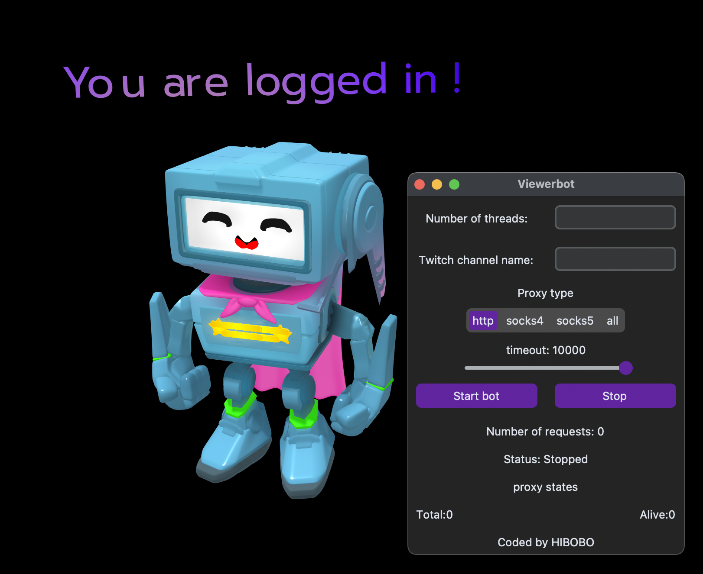
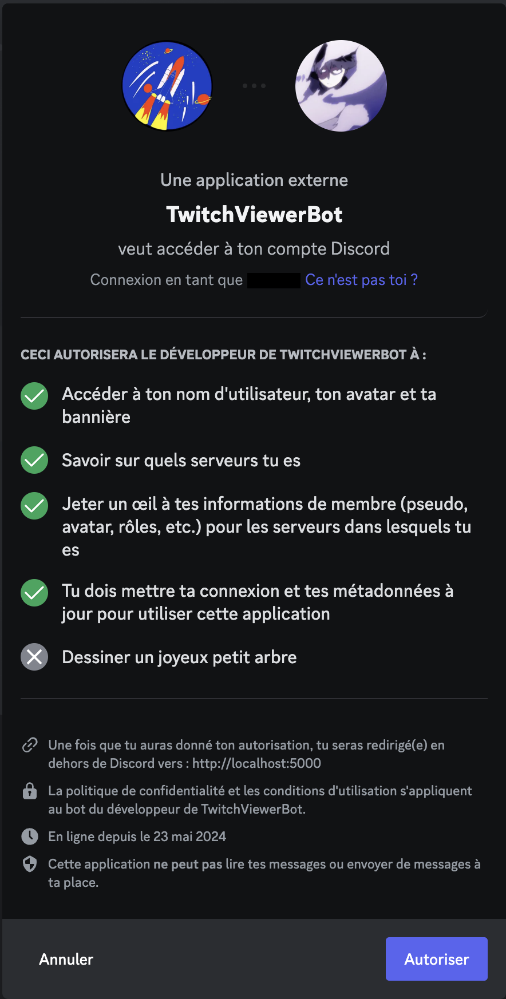

# Twitch Viewer Bot

This is a Python script for generating Twitch views using proxies. It is implemented as a GUI application with the help of the tkinter module.

## My patreon to support me or buy me a coffe

> :warning: Buy me a [coffee](https://www.buymeacoffee.com/hibobo)✓.

[My Patreon](https://www.patreon.com/HIBO)

## Requirements

- Python 3.x
- streamlink
- requests
- fake_useragent
- tkinter
  
## Patreon and Discord server to use the premium version
- 💰 [Subscribe here](https://www.patreon.com/hibo/membership)
- 🎮 [Join the server here](https://discord.gg/2Sqvx25auv)

## Download the folder

> **Warning**
> If you don't have Git installed, you can download it from [here](https://git-scm.com/download/win).

1. Open a command prompt and navigate to the location where you want to install the folder. Then use the following command:
   ```shell
   git clone https://github.com/H1B0B0/twitch-Viewerbot.git
   ```
2. Once the folder installation is complete, navigate into the folder.

> **Warning**
> You need Python installed. If you don't have it, you can download it from [here](https://www.python.org/downloads/)

## Usage

1. Install the requirements:

```shell
pip install .
```

2. Run the script:

```shell
python3 src/twitchbot/free_version.py
```

Or for Patreon subscribers, run the premium version:

```shell
python3 src/twitchbot/premium_version.py
```

or

```shell
python3 src/twitchbot/free_version.py -threads nb_threads -twitchname example_channel  -proxyfile path/to/your/proxylist
```

or

```shell
py -3 src/twitchbot/premium_version.py
```

or

```shell
py -3 src/twitchbot/free_version.py
```

or

```shell
py -3 src/twitchbot/free_version.py -threads nb_threads -twitchname example_channel
```

3. Fill in the following details in the GUI:

To get the bot started, follow these steps:

1. Enter the number of threads you want to run. Each thread corresponds to a viewer on your Twitch channel (note: due to the way the bot works, if you want 100 viewers, you need to enter 200 threads).
2. Enter the name of the Twitch channel you want to generate views for in the "Twitch channel name" field.

3. Click the "Start bot" button to start the script. The user interface will change to indicate that the bot is running:

Before clicking "Start bot":


After clicking "Start bot":


## Code Overview

The script begins by importing the necessary modules and setting up global variables.

## Code Overview

The script starts by importing the required modules and setting up global variables.

The `ViewerBot` class has methods for reading the list of proxies, getting the URL for the Twitch channel, and sending HEAD requests using proxies.

The `ViewerBotGUI` class sets up the GUI and handles button clicks.

The `main()` function creates an instance of the `ViewerBotGUI` class and starts the GUI main loop.

## Interface

 

## License

This project is licensed under the MIT License. See the LICENSE file for details.

## Warning

This code is for educational purposes only
