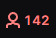

# Twitch Viewer Bot

This is a Python script for generating Twitch views using proxies. It is implemented as a GUI application with the help of the tkinter module.

## Requirements

* Python 3.x
* streamlink
* requests
* fake_useragent
* tkinter

## Usage

1. Install the requirements:

```shell
pip install -r requirements.txt
```

2. Run the script:

```shell
python main.py 
```
or 
```shell
python main_just_terminal.py
```
or
```shell
py -3 main.py 
```
or 
```shell
py -3 main_just_terminal.py
```
3. Fill in the following details in the GUI:

* Number of threads: Enter the number of threads you want to use. Each thread represents 1/10 of a single viewer(So if you want 100 viewers you need to enter 1000 threads).
* Twitch channel name: Enter the name of the Twitch channel you want to generate views for.

4. Click the "Start bot" button to start the script.
* before   
* after 

## Code Overview

The script starts by importing the required modules and setting up global variables.

The `ViewerBot` class has methods for reading the list of proxies, getting the URL for the Twitch channel, and sending HEAD requests using proxies.

The `ViewerBotGUI` class sets up the GUI and handles button clicks.

The `main()` function creates an instance of the `ViewerBotGUI` class and starts the GUI main loop.

## License

This project is licensed under the MIT License. See the LICENSE file for details.

## Warning 

This code is for educational purposes only
