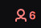
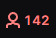
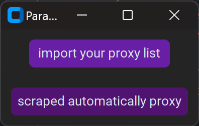
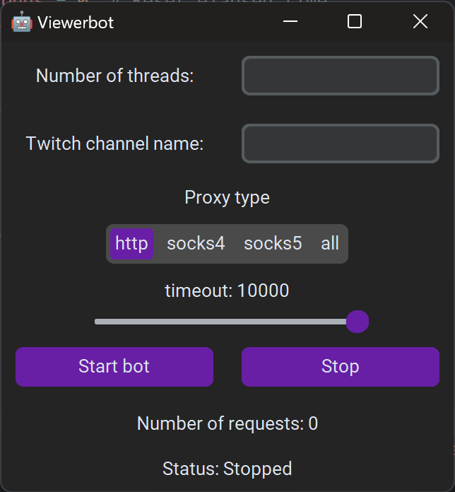

# Twitch Viewer Bot

This is a Python script for generating Twitch views using proxies. It is implemented as a GUI application with the help of the tkinter module.

## My patreon to support me

[My Patreon](https://www.patreon.com/HIBO)

## Requirements

* Python 3.x
* streamlink
* requests
* fake_useragent
* tkinter

## Download the folder

> **Warning**
> If you don't have Git installed, you can download it from [here](https://git-scm.com/download/win).

1. Open a command prompt and navigate to the location where you want to install the folder. Then use the following command:
   ```shell 
   git clone https://github.com/H1B0B0/twitch-Viewerbot.git
    ```
2. Once the folder installation is complete, navigate into the folder.

3. Run the file ``install.bat``to install the required dependencies. 

> **Warning**
> You need Python installed. If you don't have it, you can download it from [here](https://www.python.org/downloads/)

4. Run ``main.bat`` or ``main_just_terminal.bat`` if you prefer a command-line interface and better performance (the terminal version currently uses HTTP scraped proxies).

## Usage

1. Install the requirements:

```shell
pip install .
```

2. Run the script:

```shell
python3 main.py 
```
or 
```shell
python3 main_just_terminal.py
```
or 
```shell
python3 script.py -threads nb_threads -twitchname example_channel  -proxyfile path/to/your/proxylist
```
or
```shell
py -3 main.py 
```
or 
```shell
py -3 main_just_terminal.py
```
or 
```shell
py -3 script.py -threads nb_threads -twitchname example_channel
```
3. Fill in the following details in the GUI:

* Number of threads: Enter the number of threads you want to use. Each thread represents 1/10 of a single viewer(So if you want 100 viewers you need to enter 1000 threads).
* Twitch channel name: Enter the name of the Twitch channel you want to generate views for.

4. Click the "Start bot" button to start the script.
 --> 

## Code Overview

The script starts by importing the required modules and setting up global variables.

The `ViewerBot` class has methods for reading the list of proxies, getting the URL for the Twitch channel, and sending HEAD requests using proxies.

The `ViewerBotGUI` class sets up the GUI and handles button clicks.

The `main()` function creates an instance of the `ViewerBotGUI` class and starts the GUI main loop.

## Interface
 
## License

This project is licensed under the MIT License. See the LICENSE file for details.

## Warning 

This code is for educational purposes only
