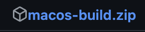
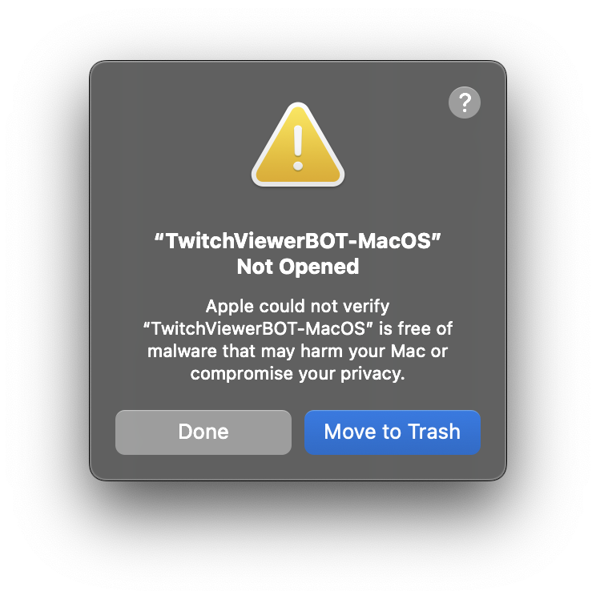
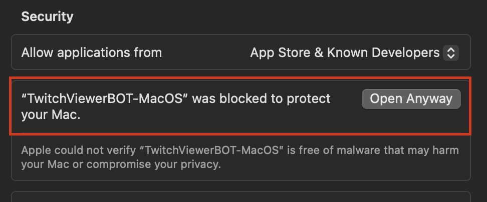
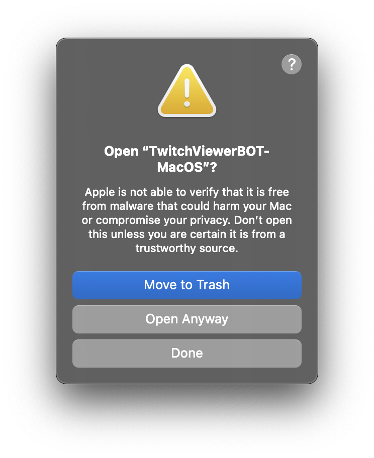

# Twitch Viewer Bot

A modern web application for generating Twitch views using proxies, built with a Flask backend and React frontend.

## Table of Contents

- [Features](#features)
- [Requirements](#requirements)
- [Installation](#installation)
- [Installation [DEV]](#installation-dev)
- [Usage [DEV]](#usage-dev)
- [How to use with macOS](#how-to-use-with-macos)
- [Screenshots](#screenshots)
- [License](#license)
- [Warning](#warning)

## Features

- 🚀 Multi-threading system supporting up to 1000 simultaneous threads
- 🔄 Automatic proxy rotation and management
- 🌐 Support for HTTP, SOCKS4, and SOCKS5 proxies
- 📊 Real-time statistics dashboard
- 🔒 SSL/HTTPS support
- 📱 Responsive web interface

## Requirements

- Python 3.9+
- Modern web browser
- Internet connection
- (Optional) Custom proxy list

## 💻 Installation

1. Download the executable.
2. Launch the application.
3. Login / Register.
4. Configure your settings.
5. Start the bot.

## Usage [DEV]

1. Clone the repository and create a virtual environment:

   ```bash
   git clone https://github.com/H1B0B0/twitch-Viewerbot.git
   cd twitch-Viewerbot
   python3 -m venv .venv
   source .venv/bin/activate
   ```

2. Install dependencies and start the Flask backend in dev mode:

   ```bash
   pip install -r requirements.txt
   python ./backend/main.py --dev
   ```

   Or start with authentication enabled:

   ```bash
   python ./backend/main.py
   ```

3. Open your web browser and navigate to `https://velbots.shop`

4. Configure the bot:

   - Enter the number of threads (recommended: 100-200)
   - Enter the Twitch channel name
   - (Optional) Upload a custom proxy list
   - Choose proxy type (HTTP, SOCKS4, SOCKS5, or ALL)

5. Click "Start Bot" to begin generating views

💡 **Dev Mode Tips:**

- Use `--dev` flag to bypass authentication requirements
- Perfect for local testing and development
- No JWT secret key needed in dev mode
- All routes and features are accessible without login

## How to use with macOS

1. Download the application from the [release page](https://github.com/H1B0B0/twitch-Viewerbot/releases).
   
2. When you try to open the application, macOS will block it because it is not from an identified developer.
   
3. Open `Settings` and go to `Security & Privacy`. Under the `Security` tab, you will see a message about the blocked application. Click `Open Anyway`.
   
4. Confirm that you want to open the application by clicking `Open Anyway` in the dialog that appears.
   
5. The application will now open, and you can start using it. Enjoy 🚀

## 📸 Screenshots


## License

This project is licensed under the MIT License. See the [LICENSE](LICENSE) file for details.

## Warning

⚠ This code is for educational purposes only ⚠
